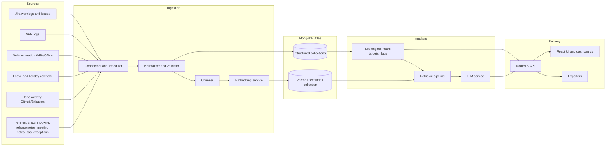

# Hybrid Work Log Monitor: AI Architecture

**Prepared by:** Chief AI Architect
**Scope:** Work log monitoring for a hybrid (office + remote) model in a software company
**Stack:** Node.js (TypeScript), React.js, MongoDB (vector store), Groq / OpenAI (LLM), Mistral / OpenAI (embeddings), AWS

---

## Problem Statement

**Worklogs are not possible to monitor in a hybrid environment.**

In a hybrid model, employees split their time between office and remote work with no fixed office days (only a total expected number of hours), and hours are recorded in Jira. Without a monitoring mechanism there is no reliable way to confirm that logged hours match the expected weekly hours and project allocations, to see whether logs are missing or inflated, or to tell whether the hours line up with the employee's declared location and VPN activity. Payroll and billing inputs, utilization tracking and manager oversight all depend on these hours.

**How this architecture addresses it**

| Gap in a hybrid environment | Architectural response |
|-----------------------------|------------------------|
| No way to check logged hours against expected hours | Rule engine compares Jira worklogs to the weekly target and project/sprint allocation (Section 6) |
| Missing, low or excess logs go unnoticed | Nightly analysis classifies every employee-week into a finding category, including under-logged, over-logged and missing logs (Sections 6, 10) |
| Office vs remote work cannot be verified | VPN sessions are cross-checked with employee self-declaration, and mismatches are flagged (Section 6) |
| Leave and holidays distort the numbers | Leave calendar is applied before hours are judged; hours logged on leave are flagged (Section 6) |
| Managers lack visibility and context | Dashboards, alerts, and LLM-generated explanations grounded in policy documents and past exceptions (Sections 5, 8) |
| Corrections and disputes are inconsistent | Past exceptions are retrievable, and manager decisions are recorded in an audit trail (Sections 4, 9) |

---

## 1. Requirements Summary (Questionnaire Outcomes)

### Answers provided by you (Q1 to Q4)

| # | Topic | Decision |
|---|-------|----------|
| 1 | Primary purpose | All four: hybrid policy compliance, payroll/billing input, project effort and utilization tracking, manager summaries and anomaly alerts |
| 2 | System of record for logged hours | Jira worklogs, with VPN data as attendance evidence |
| 3 | Hybrid policy definition | No fixed office days; only total expected working hours |
| 4 | Expected hours rule | Weekly target with flexible daily distribution, plus project/sprint-based allocation |

### Answers selected by the architect on your behalf (Q5 to Q20)

These were chosen as recommendations, as you requested. Please review them; each can be changed without affecting the rest of the design.

| # | Topic | Recommended decision |
|---|-------|----------------------|
| 5 | Office vs remote detection | VPN data cross-checked with employee self-declaration |
| 6 | Ingestion mode | Jira webhooks for incremental updates, plus a nightly scheduled full sync |
| 7 | What is vectorized | Text content only (policies, requirements, meeting notes, release notes, wiki pages, worklog comments, past exception records). Numeric hours are stored as structured fields, not vectors |
| 8 | Chunking | Section-based chunking with metadata (source, project, date, document type) |
| 9 | Embedding model | OpenAI or Mistral, behind a provider abstraction; final choice to be confirmed with a small retrieval benchmark |
| 10 | Vector and lexical store | MongoDB Atlas Vector Search plus Atlas Search (BM25-style) in the same cluster |
| 11 | Hybrid fusion | Reciprocal Rank Fusion of vector and BM25 results |
| 12 | Reranking | Rerank the top 20 candidates down to the top 5 |
| 13 | LLM usage | Provider abstraction: Groq for high-volume, low-latency summaries; OpenAI for structured-output tasks or as fallback |
| 14 | Calculation vs LLM | Deterministic rule engine computes all hours and flags. The LLM only retrieves policy context, explains findings and summarizes |
| 15 | Result categories | Compliant, under-logged, over-logged/overtime, missing logs, leave conflict, WFH vs office mismatch, anomaly, boundary case |
| 16 | Output format | Configurable exporters (JSON, CSV, dashboard). The exact target tool (HRMS, payroll, etc.) is to be confirmed |
| 17 | Human review | Managers review and approve findings; the system never edits Jira worklogs automatically |
| 18 | Authentication and roles | SSO (OIDC) with roles: Employee, Manager, HR/Admin |
| 19 | Privacy | Data minimization, employee transparency, retention policy, audit trail; no keystroke logging or screenshots |
| 20 | Evaluation and observability | Golden test set, retrieval metrics, groundedness checks, cost and latency monitoring |

---

## 2. Design Principles

1. **Numbers come from code, explanations come from the LLM.** Hours, totals, overtime and flags are computed by a deterministic rule engine. The LLM never calculates hours.
2. **Retrieval supplies policy context, not facts about hours.** Retrieved policy and past exception text grounds the explanation of each finding.
3. **Human in the loop.** Findings are recommendations for managers and HR, not automatic actions.
4. **Privacy by design.** Collect only what the stated purposes require and be transparent to employees about it.
5. **Provider independence.** LLM and embedding providers sit behind interfaces so they can be switched by configuration.

---

## 3. High-Level Architecture

---

## 4. Ingestion Pipeline (Critical)

**Flow:** Input -> Normalize -> (Chunk -> Embed) -> Store in MongoDB

| Input source | Vector? | Handling |
|--------------|---------|----------|
| Requirements and policies (User story, BRD, FRD, hybrid policy, HR policy) | Yes | Chunk, embed, store with metadata |
| Jira worklogs and issues | Yes (text only) | Numeric fields (hours, dates, author) stored structured. Issue and worklog comment text chunked and embedded |
| VPN logs | No | Stored as session records (user, start, end) |
| Self-declaration (WFH/office) | No | Stored as structured daily records |
| Leave and holiday calendar | No | Stored as structured records |
| Developer code repo activity (GitHub/Bitbucket) | No | Optional context, stored as activity summaries only |
| Meeting notes / recordings | Yes | Transcript text chunked and embedded |
| Sprint plans / release notes | Yes | Chunk, embed, store |
| Confluence / wiki / technical documentation | Yes | Chunk by section, embed, store |
| Past exception and correction records | Yes | Embed reason and resolution text; keep outcome as structured fields |

**Ingestion behavior**
- **Incremental:** Jira webhooks push new and changed worklogs.
- **Scheduled:** a nightly job re-syncs all sources and catches missed events.
- **Idempotent:** each record carries a source ID and content hash; unchanged content is not re-embedded.
- **Failures:** failed items go to a retry queue and then a dead-letter queue, with alerts.

---

## 5. Retrieval Pipeline (Critical)

**Flow:** Query -> Preprocess -> Vector + BM25 -> Fuse -> Rerank -> Deduplicate -> Summarize -> Prompt + Query + Context -> LLM

1. **Query preprocessing:** normalization, abbreviation expansion (e.g. WFH, OT, PTO), synonym expansion.
2. **Search:** vector search and BM25 search run in parallel against the same collection, with metadata filters (document type, project, date range).
3. **Hybrid fusion:** results merged using Reciprocal Rank Fusion.
4. **Reranking:** top 20 candidates reranked, top 5 kept.
5. **Deduplication:** near-duplicate chunks removed.
6. **Summarization:** retrieved context condensed to fit the prompt budget.
7. **Generation:** prompt, query and context sent to the LLM.

**Prompt contract:** the LLM receives the rule engine's structured finding (already calculated) plus retrieved policy context, and returns a structured explanation. It is instructed to cite the retrieved source for every policy statement and to answer "not found in the provided context" rather than guess.

---

## 6. Rule Engine (Deterministic)

Computes, per employee and per period:

- Weekly logged hours against the weekly target, with flexible distribution across days.
- Project and sprint allocation against logged hours per project.
- Adjustments for approved leave and holidays.
- Cross-check of logged hours with VPN sessions and self-declared location.

**Finding categories**

| Category | Meaning |
|----------|---------|
| Compliant | Logged hours meet the target and allocation |
| Under-logged | Hours below target without leave cover |
| Over-logged / overtime | Hours above the configured threshold |
| Missing logs | Days or periods with no worklog entries |
| Leave conflict | Hours logged on approved leave or a holiday |
| WFH vs office mismatch | Self-declaration conflicts with VPN evidence |
| Anomaly | Unusual pattern (e.g. bulk entries, identical entries repeated) |
| Boundary case | Hours within a configurable tolerance of a threshold, flagged for review |

All thresholds and tolerances are configuration, not code.

---

## 7. Data Model (MongoDB)

| Collection | Purpose | Key fields |
|------------|---------|------------|
| `worklogs` | Jira worklog records | employeeId, issueKey, project, hours, date, comment, sourceId, hash |
| `vpn_sessions` | VPN attendance evidence | employeeId, start, end |
| `declarations` | Self-declared location per day | employeeId, date, location |
| `leave_calendar` | Leave and holidays | employeeId, date, type |
| `knowledge_chunks` | Vectorized text | text, embedding, docType, source, project, date, metadata |
| `exceptions` | Past corrections and disputes | employeeId, reason, resolution, approvedBy, date |
| `findings` | Rule engine output and LLM explanation | employeeId, period, category, values, explanation, sources, status |
| `audit_log` | Append-only record of views, edits and approvals | actor, action, target, timestamp |

**Indexes:** Atlas Vector Search index and Atlas Search (text) index on `knowledge_chunks`; compound indexes on `(employeeId, date)` for time-based collections.

---

## 8. Application Layer

**Backend (Node.js, TypeScript)**
- REST API with modules: ingestion, rules, retrieval, findings, exports, admin.
- Provider interfaces for LLM and embeddings (Groq, OpenAI, Mistral).
- Job workers for ingestion and nightly analysis.

**Frontend (React.js)**
- Employee view: own hours, findings, and the ability to add an explanation.
- Manager view: team summary, findings queue, approve/reject with comment.
- HR/Admin view: policy configuration, thresholds, export, audit log.

**Exporters:** JSON and CSV first; connectors to the target HRMS or payroll tool once that tool is confirmed.

### 8.1 API Endpoints (v1)

Base path: `/api/v1`. All endpoints require SSO authentication except the Jira webhook, which uses a shared-secret signature. Access is scoped by role: **E** = Employee (own data), **M** = Manager (direct reports), **H** = HR/Admin, **S** = System/service.

**Identity and health**

| Method | Path | Roles | Purpose |
|--------|------|-------|---------|
| GET | `/me` | E, M, H | Current user, role and team |
| GET | `/health` | S | Service health check |

**Ingestion**

| Method | Path | Roles | Purpose |
|--------|------|-------|---------|
| POST | `/ingestion/jira/webhook` | S | Receive Jira worklog create/update/delete events |
| POST | `/ingestion/sync` | H | Trigger a full sync for a source (`jira`, `vpn`, `leave`, `knowledge`) |
| GET | `/ingestion/jobs` | H | List ingestion jobs and status |
| GET | `/ingestion/jobs/{jobId}` | H | Job detail, counts and failures |
| POST | `/attendance/vpn-sessions` | S | Batch load VPN sessions |
| POST | `/leave/sync` | S, H | Load leave and holiday calendar |

**Knowledge base (vectorized documents)**

| Method | Path | Roles | Purpose |
|--------|------|-------|---------|
| POST | `/knowledge/documents` | H | Register or upload a document (policy, BRD/FRD, release notes, meeting notes, wiki page) for chunking and embedding |
| GET | `/knowledge/documents` | H | List documents with status and type |
| DELETE | `/knowledge/documents/{docId}` | H | Remove a document and its chunks |
| POST | `/retrieval/search` | H | Run the retrieval pipeline for a query (admin testing and tuning) |

**Declarations and worklogs**

| Method | Path | Roles | Purpose |
|--------|------|-------|---------|
| PUT | `/declarations/{date}` | E | Set own WFH/office declaration for a date |
| GET | `/declarations` | E, M, H | Declarations by employee and date range |
| GET | `/worklogs` | E, M, H | Worklogs filtered by employee, project, date range |
| GET | `/employees/{employeeId}/summary` | E, M, H | Weekly hours vs target, project allocation, attendance evidence |
| GET | `/teams/{teamId}/summary` | M, H | Team-level hours and findings overview |

**Analysis and findings**

| Method | Path | Roles | Purpose |
|--------|------|-------|---------|
| POST | `/analysis/run` | H, S | Run the rule engine for a period (scheduled nightly, or on demand) |
| GET | `/findings` | E, M, H | List findings by employee, category, status, period |
| GET | `/findings/{findingId}` | E, M, H | Finding detail with rule values, LLM explanation and cited sources |
| POST | `/findings/{findingId}/explain` | M, H | Regenerate the LLM explanation |
| POST | `/findings/{findingId}/response` | E | Employee adds an explanation or supporting note |
| POST | `/findings/{findingId}/decision` | M, H | Approve, reject or comment; recorded in the audit log |

**Configuration**

| Method | Path | Roles | Purpose |
|--------|------|-------|---------|
| GET | `/config/rules` | H | Weekly targets, overtime thresholds, tolerances by role or contract type |
| PUT | `/config/rules` | H | Update rule configuration (versioned) |

**Exports and audit**

| Method | Path | Roles | Purpose |
|--------|------|-------|---------|
| POST | `/exports` | M, H | Create an export (`json`, `csv`) for a period and filter |
| GET | `/exports/{exportId}` | M, H | Export status and download link |
| GET | `/audit-log` | H | Query the audit trail |

**Conventions**
- JSON request and response bodies; ISO 8601 dates; hours as decimals.
- Pagination with `page` and `pageSize`; filtering by query parameters.
- Errors use a standard shape: `{ "error": { "code", "message", "details" } }`.
- Long-running operations (`/ingestion/sync`, `/analysis/run`, `/exports`) return `202 Accepted` with a job or export ID.
- Write endpoints accept an `Idempotency-Key` header.

---

## 9. Security and Privacy

- **Authentication:** SSO via OIDC; **roles:** Employee, Manager, HR/Admin, enforced at the API.
- **Access scope:** employees see only their own data; managers see only their direct reports.
- **Data minimization:** no keystroke logging, screenshots or content monitoring; VPN data limited to session start and end.
- **Transparency:** employees are informed what is collected, why, and who can see it.
- **Encryption:** TLS in transit; encryption at rest for MongoDB and S3.
- **Retention:** defined retention period per collection, agreed with HR and legal.
- **Secrets:** API keys for Jira, LLM and embedding providers held in AWS Secrets Manager.
- **LLM data handling:** send only the fields needed for an explanation; use provider settings that prevent training on submitted data.
- **Audit:** every view, approval and edit of a finding is written to `audit_log`.

---

## 10. AWS Deployment

| Concern | Service |
|---------|---------|
| API and workers | ECS on Fargate behind an Application Load Balancer |
| Frontend | S3 with CloudFront |
| Database | MongoDB Atlas on AWS, connected privately (PrivateLink or VPC peering) |
| Scheduled jobs | EventBridge Scheduler |
| Queues | SQS with dead-letter queue |
| Secrets | AWS Secrets Manager |
| Exports and artifacts | S3 |
| Logs and metrics | CloudWatch |
| Network | Private subnets for services, outbound access through NAT for provider APIs |

---

## 11. Evaluation and Observability

- **Golden set:** a curated set of known employee-week scenarios with expected categories, used as a regression suite for the rule engine.
- **Retrieval quality:** measure recall@k and precision on a labeled set of policy questions.
- **Groundedness:** check that every policy statement in an explanation is supported by a retrieved chunk.
- **Operational metrics:** ingestion lag, failure rate, latency per pipeline stage, token usage and cost per provider.
- **Feedback loop:** manager approve/reject decisions are stored and used to review false positives.

---

## 12. Items to Confirm (Not Assumed)

The following were not provided and are deliberately left open:

1. Jira deployment type (Cloud or Data Center) and how worklogs are recorded (native Jira worklogs or a plugin).
2. VPN product and log format, and how sessions can be extracted.
3. Where self-declaration of WFH/office is captured today.
4. Target tool for the output (HRMS, payroll, Jira, dashboard) and its import format.
5. Number of employees and expected data volume.
6. Weekly target values, overtime thresholds and tolerances per role or contract type.
7. Retention periods and any legal or regional data-privacy requirements.
8. Final embedding model and LLM choice after a small benchmark.

---

## 13. Suggested Delivery Phases

1. **Foundation:** Jira and VPN ingestion, structured collections, rule engine, basic dashboard.
2. **Knowledge layer:** policy and document ingestion, embeddings, retrieval pipeline.
3. **Explanations:** LLM-generated finding explanations with citations, manager review workflow.
4. **Integration and hardening:** exporters, evaluation suite, monitoring, privacy review.
